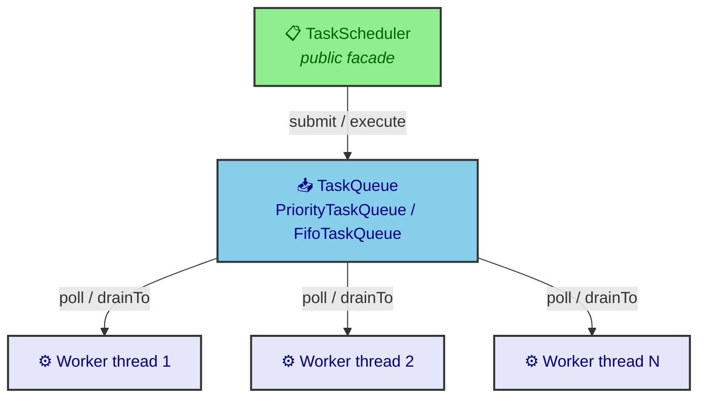
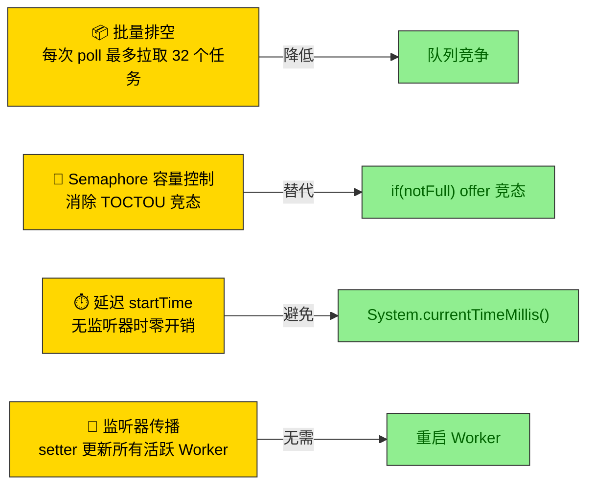

<div align="center">

# PrioriTask

**轻量级优先级感知任务调度框架**

[](https://github.com/zhentaozhang/PrioriTask/actions)
[](#)
[](#)
[](LICENSE)

[概述](#概述) • [快速开始](#快速开始) • [使用指南](#使用指南) • [定时任务](#定时任务) • [监控](#监控) • [架构](#架构) • [基准测试](#基准测试)

</div>

## 概述

**PrioriTask** 是一个面向 Java 17 的最小化任务调度库，支持优先级排序、生命周期钩子和运行时指标采集。与 `ThreadPoolExecutor` 不同，它在队列层面内置了优先级排序能力，无需额外的优先级队列包装器。

**核心特性：**

- **优先级执行** — 三级优先级（`LOW` / `MEDIUM` / `HIGH`），严格按序出队
- **`Task<V>` 即 `Future<V>`** — `submit()` 直接返回任务本身，无需额外管理 Future 句柄
- **定时与周期任务** — `TimerScheduler` 支持延迟执行、固定频率和固定延迟
- **运行时指标** — 延迟直方图（P50/P95/P99）、排队等待时间、可配置采样率
- **优雅关闭** — 各生命周期阶段独立超时配置，`shutdownNow()` 返回剩余任务
- **轻量** — 零外部运行时依赖，平均每类 ~1.2 kB

## 快速开始

需 Java 17+ 和 Maven：

```bash
git clone https://github.com/zhentaozhang/PrioriTask.git
cd PrioriTask
mvn package
```

## 使用指南

### 基础用法

```java
TaskScheduler pool = new TaskScheduler(4);     // 4 个工作线程

// 提交 Runnable
Task<Void> task = pool.submit(() -> {
    System.out.println("Hello from prioritask");
});

// 提交 Callable，返回结果
Task<String> result = pool.submit(() -> "done");
System.out.println(result.get());               // "done"

pool.shutdown();
```

返回的 `Task<V>` 实现了 `Future<V>`，因此可直接调用 `.get()`、`.cancel()`、`.isDone()`，同时还能直接访问 `.state()`、`.priority()`、`.taskId()`、`.startTime()` 和 `.finishTime()`。

### 优先级

```java
pool.submit(() -> doHeavyWork(), Priority.LOW);
pool.submit(() -> urgentTask(),  Priority.HIGH);

Task<Void> task = Task.ofRunnable(runnable, Priority.HIGH);
pool.execute(task);
```

任务严格按优先级出队：`HIGH > MEDIUM > LOW`。同优先级内保持 FIFO 顺序。

> [!TIP]
> 默认优先级为 `MEDIUM`。可通过 `Priority.defaultPriority()` 程序化引用。

### 关闭与排空

```java
// 优雅关闭——等待运行中的任务完成后终止
pool.setShutdownTimeout(30, TimeUnit.SECONDS);
pool.shutdown();

// 强制关闭——中断工作线程，返回队列中剩余任务
List<Task<?>> remaining = pool.shutdownNow();
```

### 自定义拒绝策略

```java
pool.setRejectedHandler((task, scheduler) -> {
    System.err.println("Rejected: " + task);
    persistentQueue.store(task);
});
```

默认拒绝策略抛出 `RejectedExecutionException`。

## 定时任务

`TimerScheduler` 基于 `DelayQueue` 提供延迟和周期执行能力：

```java
TaskScheduler pool = new TaskScheduler(2);
TimerScheduler timer = new TimerScheduler(pool);

// 1秒后执行一次
timer.schedule(() -> System.out.println("Fired!"), 1, TimeUnit.SECONDS);

// 每 500ms 执行一次（固定频率）
ScheduledTaskHandle heartbeat = timer.scheduleAtFixedRate(
    () -> System.out.println("Ping"), 0, 500, TimeUnit.MILLISECONDS);

// 2.5 秒后取消
Thread.sleep(2500);
heartbeat.cancel(true);

timer.shutdown();
pool.shutdown();
```

## 监控

`PoolMetrics` 实现 `TaskListener` 接口，以最小开销采集延迟直方图：

```java
PoolMetrics metrics = new PoolMetrics();
pool.setTaskListener(metrics);

// 后续获取
System.out.printf("P50=%.1fµs  P95=%.1fµs  P99=%.1fµs%n",
    metrics.p50(), metrics.p95(), metrics.p99());
System.out.println("平均排队等待: " + metrics.avgQueueWaitMicros() + "µs");
```

延迟桶范围从 1µs 到 10s，呈指数分布。采样率可调：

```java
metrics.setSampleRate(10);   // 每 10 个任务采样一次
```

> [!TIP]
> 未设置 `TaskListener` 时，监控默认关闭。热路径无内存分配，且避免 `System.currentTimeMillis()` 系统调用。

## 架构

PrioriTask 采用**线程-每-工作者**模型，共享任务队列：



### 包结构

| 包 | 职责 |
|---|---|
| `core` | `TaskScheduler` — 公开 API、生命周期管理、任务提交 |
| `queue` | `TaskQueue` 接口、`PriorityTaskQueue`、`FifoTaskQueue` |
| `worker` | `WorkerPool`、`Worker`（轮询 → 批量获取 → 执行循环） |
| `task` | `Task<V>`（实现 `Future<V>`）、`TaskState`、`Priority` |
| `scheduler` | `TimerScheduler`、`DelayedTask`、`ScheduledTaskHandle` |
| `monitor` | `PoolMetrics` — 延迟桶、排队等待追踪 |
| `common` | `TaskListener`、`TaskExceptionHandler`、`RejectedExecutionHandler` |

### 核心设计决策



## 基准测试

JMH 吞吐量基准测试对比空任务提交（纯调度开销）与 `ThreadPoolExecutor` + `LinkedBlockingQueue`：

```
Benchmark                              (poolSize)   Mode  Cnt          Score   Units
TaskSchedulerBenchmark.baseline_counter         4  thrpt    2  565,466,409   ops/s
TaskSchedulerBenchmark.custom_empty             4  thrpt    2    5,904,428   ops/s
TaskSchedulerBenchmark.jdk_empty                4  thrpt    2    5,559,689   ops/s
```

`custom_empty`（~5.9M ops/s）与 JDK `ThreadPoolExecutor` 差距在 ~6% 以内。`baseline_counter` 显示单次 `AtomicInteger.incrementAndGet()` 的开销约为 565M ops/s——调度器每次提交/执行往返增加约 95ns 开销。

本地运行基准测试：

```bash
mvn test-compile
java -cp "target/test-classes:target/classes:$(mvn -q dependency:build-classpath -DincludeScope=test)" \
  org.openjdk.jmh.Main .*Benchmark
```
